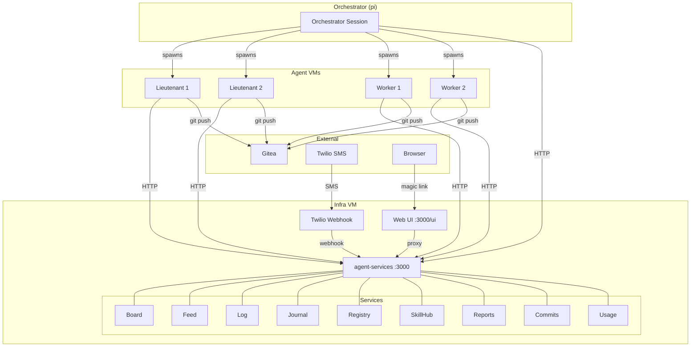
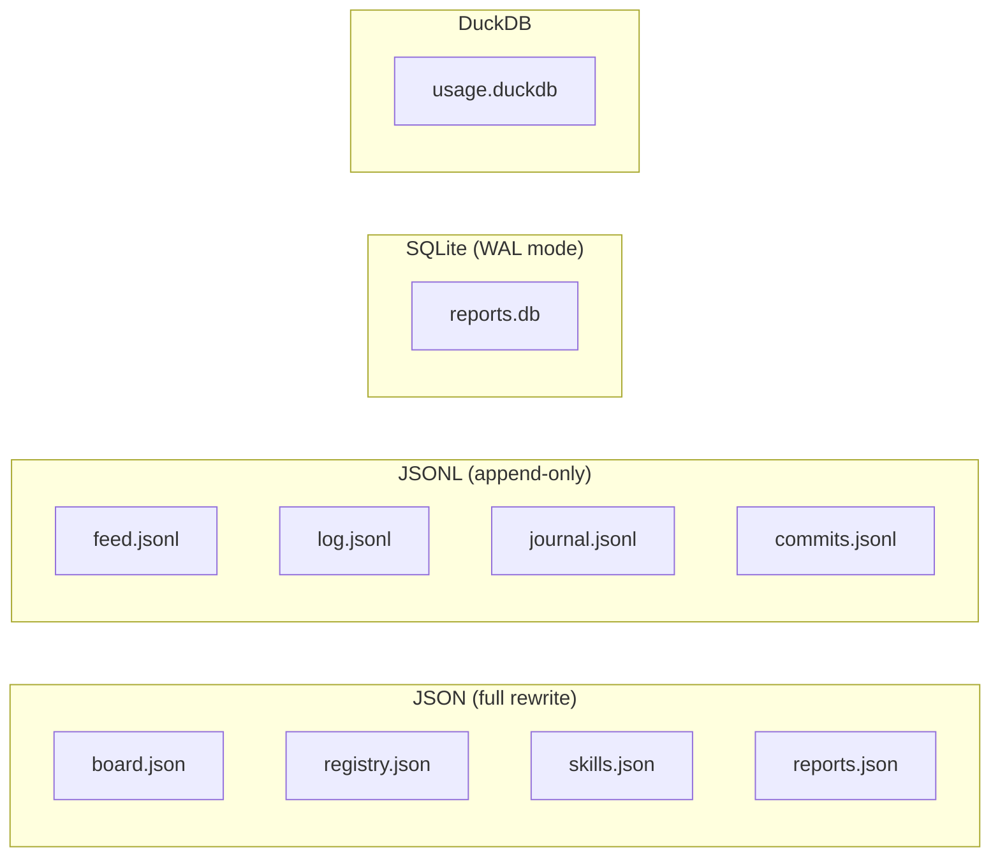
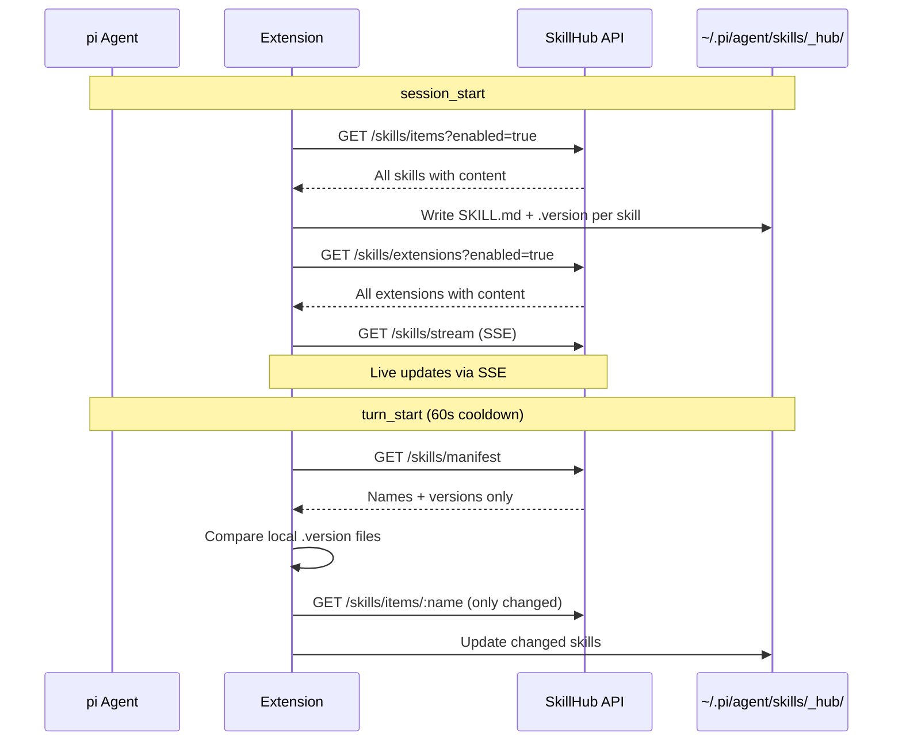
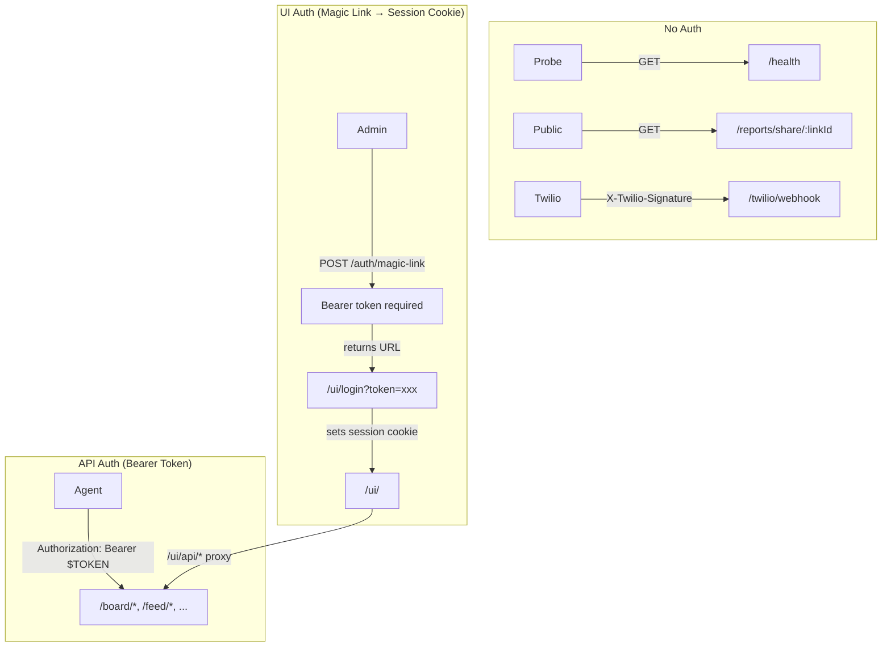

# Architecture

> vers-agent-services — coordination layer for AI agent swarms on Vers

## System Overview

vers-agent-services is a single HTTP server that provides shared state and coordination for a fleet of [pi](https://github.com/mariozechner/pi-coding-agent) coding agents running on [Vers](https://vers.sh) VMs. It is **not** a platform requirement — it's an optional `pi install` package that makes multi-agent work better.

The typical deployment:

```
Human operator
    │
    ▼
┌──────────────┐       ┌──────────────────────────────────────┐
│ Orchestrator │       │         Infra VM (:3000)             │
│   (pi)       │◄─────►│   vers-agent-services (Hono)        │
│              │       │                                      │
│  spawns LTs  │       │  board · feed · log · journal        │
│  & swarms    │       │  registry · skills · reports         │
│              │       │  commits · usage · twilio · ui       │
└──────┬───────┘       └───────────────▲──────────────────────┘
       │                               │
       ├───────────────┬───────────────┤
       ▼               ▼               ▼
┌────────────┐  ┌────────────┐  ┌────────────┐
│   LT-docs  │  │  LT-infra  │  │  Worker-1  │
│ (Vers VM)  │  │ (Vers VM)  │  │ (Vers VM)  │
│  pi agent  │  │  pi agent  │  │  pi agent  │
└────────────┘  └────────────┘  └────────────┘
```

**Orchestrator** — a pi session (often running locally or on a VM) that spawns lieutenants and swarm workers using `vers_lt_create` / `vers_swarm_spawn`.

**Lieutenants (LTs)** — long-lived pi agents on Vers VMs, each with a specialized role. They persist across tasks and accumulate context.

**Workers** — short-lived pi agents branched from a golden image, assigned a single task, then destroyed.

**Agent-services** — the shared coordination bus. All agents talk to it over HTTP. A pi extension (`extensions/agent-services.ts`) wraps the API into tools and handles automatic behaviors.



## Service Inventory

### Board — Task Tracking
Shared kanban board for creating, assigning, and tracking tasks across the fleet. Supports notes (findings, blockers, questions), artifacts, review submissions, and priority bumping.

| | |
|---|---|
| **Files** | `src/board/store.ts`, `src/board/routes.ts` |
| **Storage** | JSON file (`data/board.json`) — full rewrite on change (debounced) |
| **Key endpoints** | `POST /board/tasks`, `PATCH /board/tasks/:id`, `POST /board/tasks/:id/notes`, `POST /board/tasks/:id/review`, `POST /board/tasks/:id/bump` |

### Feed — Activity Event Stream
Real-time event stream for coordination and observability. Supports SSE for live tailing. Events have typed categories (`agent_started`, `task_completed`, `blocker_found`, etc.).

| | |
|---|---|
| **Files** | `src/feed/store.ts`, `src/feed/routes.ts` |
| **Storage** | JSONL file (`data/feed.jsonl`) — append-only |
| **Key endpoints** | `POST /feed/events`, `GET /feed/events`, `GET /feed/stream` (SSE), `GET /feed/stats` |

### Log — Work Log
Carmack `.plan`-style operational log. Timestamped, append-only. For recording what happened, what was decided, what's next.

| | |
|---|---|
| **Files** | `src/log/store.ts`, `src/log/routes.ts` |
| **Storage** | JSONL file (`data/log.jsonl`) — append-only |
| **Key endpoints** | `POST /log`, `GET /log`, `GET /log/raw` |

### Journal — Personal Narrative Log
Separate from operational logs. For thoughts, vibes, product intuitions. Supports mood tags and categorization. Can be written via SMS (Twilio).

| | |
|---|---|
| **Files** | `src/journal/store.ts`, `src/journal/routes.ts` |
| **Storage** | JSONL file (`data/journal.jsonl`) — append-only |
| **Key endpoints** | `POST /journal`, `GET /journal`, `GET /journal/raw` |

### Registry — VM Service Discovery
Agents register themselves so others can discover them by role. Includes heartbeat-based liveness detection (5 min stale threshold).

| | |
|---|---|
| **Files** | `src/registry/store.ts`, `src/registry/routes.ts` |
| **Storage** | JSON file (`data/registry.json`) — full rewrite on change (debounced) |
| **Key endpoints** | `POST /registry/vms`, `GET /registry/discover/:role`, `POST /registry/vms/:id/heartbeat` |

### SkillHub — Skill & Extension Registry
Central registry for managing skills and extensions across the fleet. Agents sync from the hub on startup, receive live updates via SSE, and do lightweight manifest-based syncs on each turn (60s cooldown).

| | |
|---|---|
| **Files** | `src/skills/store.ts`, `src/skills/routes.ts` |
| **Storage** | JSON file (`data/skills.json`) — full rewrite on change |
| **Key endpoints** | `POST /skills/items` (upsert), `GET /skills/manifest`, `POST /skills/sync`, `GET /skills/stream` (SSE), `GET /skills/agents` |

### Reports — Markdown Reports with Sharing
Create structured markdown reports and share them with external stakeholders via public share links. Share links have access logging and optional expiration.

| | |
|---|---|
| **Files** | `src/reports/store.ts`, `src/reports/routes.ts`, `src/reports/share-store.ts`, `src/reports/share-routes.ts` |
| **Storage** | JSON file (`data/reports.json`) for reports; SQLite (`data/reports.db`) for share links + access logs |
| **Key endpoints** | `POST /reports`, `POST /reports/:id/share`, `GET /reports/share/:linkId` (public, no auth) |

### Commits — VM Snapshot Ledger
Tracks Vers VM commits — golden images, infra snapshots, rollback points. Labels and tags for organization.

| | |
|---|---|
| **Files** | `src/commits/store.ts`, `src/commits/routes.ts` |
| **Storage** | JSONL file (`data/commits.jsonl`) — append-only |
| **Key endpoints** | `POST /commits`, `GET /commits`, `GET /commits/:id` |

### Usage — Cost & Token Tracking
Tracks token usage, cost, tool calls, and VM lifecycle events across the fleet. DuckDB for efficient aggregation queries.

| | |
|---|---|
| **Files** | `src/usage/store.ts`, `src/usage/routes.ts` |
| **Storage** | DuckDB (`data/usage.duckdb`) |
| **Key endpoints** | `GET /usage` (summary), `POST /usage/sessions`, `GET /usage/sessions`, `POST /usage/vms`, `GET /usage/vms` |

### Twilio — SMS Integration
Receives SMS via Twilio webhook. Messages are routed by prefix: `j:` → journal, `t:` → task, `l:` → log (default: journal). Validates `X-Twilio-Signature` and checks phone allowlist.

| | |
|---|---|
| **Files** | `src/twilio/routes.ts` |
| **Storage** | None (writes to journal/board/log stores) |
| **Key endpoints** | `POST /twilio/webhook` (no bearer auth — Twilio signature validation) |

### Web UI — Dashboard
Static HTML/JS dashboard with three tabs: Dashboard (board + live feed via SSE + registry), Log, and Journal. Session-authenticated via magic links.

| | |
|---|---|
| **Files** | `src/ui/routes.ts`, `src/ui/auth.ts`, `src/ui/static/` |
| **Storage** | In-memory (magic links, sessions) |
| **Key endpoints** | `GET /ui/`, `POST /auth/magic-link`, `GET /ui/login`, `/ui/api/*` (proxy) |

## Data Storage Patterns



| Pattern | Services | How it works |
|---------|----------|--------------|
| **JSON file** | Board, Registry, Skills, Reports | Full state in memory, debounced flush to disk on writes. Simple, but O(n) writes. |
| **JSONL file** | Feed, Log, Journal, Commits | Append-only. Loaded into memory on startup, new entries appended to file. Good for event streams. |
| **SQLite** | Share links (reports) | `better-sqlite3` with WAL mode. Used where relational queries matter (join share links → access logs). |
| **DuckDB** | Usage | Columnar analytics DB. Efficient aggregation over session/VM records by time range, agent, model. |
| **In-memory** | UI auth (magic links, sessions) | Ephemeral. Lost on restart. Fine because magic links are short-lived (5 min) and sessions are 24h. |

All persistent data lives under `DATA_DIR` (default: `./data`).

## Extension — `extensions/agent-services.ts`

The pi extension is what makes agent-services zero-config for agents. Install the package and agents automatically get tools + behaviors.

### Tools Registered

| Category | Tools |
|----------|-------|
| **Board** | `board_create_task`, `board_list_tasks`, `board_update_task`, `board_add_note`, `board_submit_for_review`, `board_add_artifact`, `board_bump` |
| **Feed** | `feed_publish`, `feed_list`, `feed_stats` |
| **Log** | `log_append`, `log_query` |
| **Journal** | `journal_entry` |
| **Registry** | `registry_list`, `registry_register`, `registry_discover`, `registry_heartbeat` |
| **SkillHub** | `skillhub_sync` |
| **Usage** | `usage_summary`, `usage_sessions`, `usage_vms` |

### Automatic Behaviors

These fire without any agent action:

| Trigger | Behavior |
|---------|----------|
| `session_start` | Start status widget (polls every 30s), start heartbeat (every 60s), sync skills + extensions from SkillHub, subscribe to SSE for live skill updates |
| `agent_start` | Publish `agent_started` to feed, self-register in registry using `VERS_VM_ID` |
| `turn_end` | Accumulate token/cost metrics, publish `token_update` to feed |
| `turn_start` | Lightweight skill sync (manifest diff, 60s cooldown) |
| `agent_end` | POST session usage summary, publish `agent_stopped` to feed (with turn/token/cost summary), set registry status to `stopped` |
| `tool_result` | Track VM lifecycle events (`vers_vm_create/delete/commit`) → POST to `/usage/vms` |
| `session_shutdown` | Clear heartbeat + widget timers, disconnect SSE |

### Event Bus Integration

The extension listens for events from the swarm/lieutenant extensions via `pi.events`:

| Event | Action |
|-------|--------|
| `vers:agent_spawned` | Register worker VM in registry |
| `vers:agent_destroyed` | Delete worker VM from registry |
| `vers:lt_created` | Register lieutenant VM in registry |
| `vers:lt_destroyed` | Delete lieutenant VM from registry |

### SkillHub Client Flow



Skills already installed from git packages (under `~/.pi/agent/git/`) are skipped to avoid collision warnings.

## Auth Model



**Bearer token** — All `/board/*`, `/feed/*`, `/log/*`, `/registry/*`, `/skills/*`, `/reports/*` (admin), `/usage/*`, `/commits/*`, `/journal/*` endpoints require `Authorization: Bearer $VERS_AUTH_TOKEN`. If `VERS_AUTH_TOKEN` is not set, auth is disabled (dev mode).

**Magic links** — The web UI uses a two-step flow: (1) an authenticated API call creates a magic link (5 min TTL), (2) opening the link sets a session cookie (24h TTL). The UI's `/ui/api/*` proxy injects the bearer token server-side so the browser never sees it.

**Twilio** — Uses `X-Twilio-Signature` HMAC-SHA1 validation + phone number allowlist. No bearer token.

**Public share links** — `GET /reports/share/:linkId` is completely unauthenticated. Access is logged.

## Deployment

### Single Process

Everything runs as one Node.js process (Hono HTTP server). No microservices, no message queues, no separate databases to manage.

```bash
# Build and run
npm run build
VERS_AUTH_TOKEN=$(openssl rand -hex 32) PORT=3000 node dist/server.js
```

### Infra VM

In production, agent-services runs on a dedicated Vers "infra VM". The typical setup:

```bash
# On the infra VM
git clone <repo>
cd vers-agent-services
npm install && npm run build

# Run via systemd or direct
VERS_AUTH_TOKEN=<token> PORT=3000 npm start
```

The infra VM is accessible at `<vm-id>.vm.vers.sh:3000`. All Vers VM ports are publicly routable, so **always set `VERS_AUTH_TOKEN` in production**.

### Agent Configuration

Every agent VM needs these environment variables:

| Variable | Purpose |
|----------|---------|
| `VERS_INFRA_URL` | Base URL of agent-services (e.g. `http://<vm-id>.vm.vers.sh:3000`) |
| `VERS_AUTH_TOKEN` | Must match the server's token |
| `VERS_VM_ID` | This VM's Vers ID (enables auto-registration + heartbeat) |
| `VERS_AGENT_NAME` | Human-readable name (default: `agent-<pid>`) |
| `VERS_AGENT_ROLE` | Registry role: `worker`, `lieutenant`, `infra`, etc. |

### File Structure

```
vers-agent-services/
├── src/
│   ├── server.ts              # Hono app, mounts all routes
│   ├── auth.ts                # Bearer token middleware
│   ├── board/                 # Task board service
│   │   ├── store.ts           # BoardStore (JSON)
│   │   └── routes.ts          # /board/* routes
│   ├── feed/                  # Activity feed service
│   │   ├── store.ts           # FeedStore (JSONL) + SSE subscribers
│   │   └── routes.ts
│   ├── log/                   # Work log service
│   │   ├── store.ts           # LogStore (JSONL)
│   │   └── routes.ts
│   ├── journal/               # Personal journal service
│   │   ├── store.ts           # JournalStore (JSONL)
│   │   └── routes.ts
│   ├── registry/              # VM registry service
│   │   ├── store.ts           # RegistryStore (JSON)
│   │   └── routes.ts
│   ├── skills/                # SkillHub service
│   │   ├── store.ts           # SkillStore (JSON)
│   │   └── routes.ts
│   ├── reports/               # Reports + sharing service
│   │   ├── store.ts           # ReportsStore (JSON)
│   │   ├── share-store.ts     # ShareStore (SQLite)
│   │   ├── share-routes.ts    # Public + admin share routes
│   │   └── routes.ts
│   ├── commits/               # Commit ledger service
│   │   ├── store.ts           # CommitStore (JSONL)
│   │   └── routes.ts
│   ├── usage/                 # Usage tracking service
│   │   ├── store.ts           # UsageStore (DuckDB)
│   │   └── routes.ts
│   ├── twilio/                # SMS webhook
│   │   └── routes.ts
│   └── ui/                    # Web dashboard
│       ├── auth.ts            # Magic links + sessions
│       ├── routes.ts          # UI routes + API proxy
│       └── static/            # HTML/CSS/JS
├── extensions/
│   └── agent-services.ts      # pi extension (tools + auto-behaviors)
├── skills/                    # Bundled skill docs
│   ├── board/
│   ├── feed/
│   ├── log/
│   ├── registry/
│   ├── reports/
│   ├── commits/
│   ├── deploy/
│   ├── recovery/
│   ├── preview-deploy/
│   └── swarm-coordination/
├── data/                      # Runtime data (gitignored)
│   ├── board.json
│   ├── feed.jsonl
│   ├── log.jsonl
│   ├── journal.jsonl
│   ├── registry.json
│   ├── skills.json
│   ├── reports.json
│   ├── reports.db
│   ├── commits.jsonl
│   └── usage.duckdb
└── package.json               # pi-package (extensions + skills)
```
